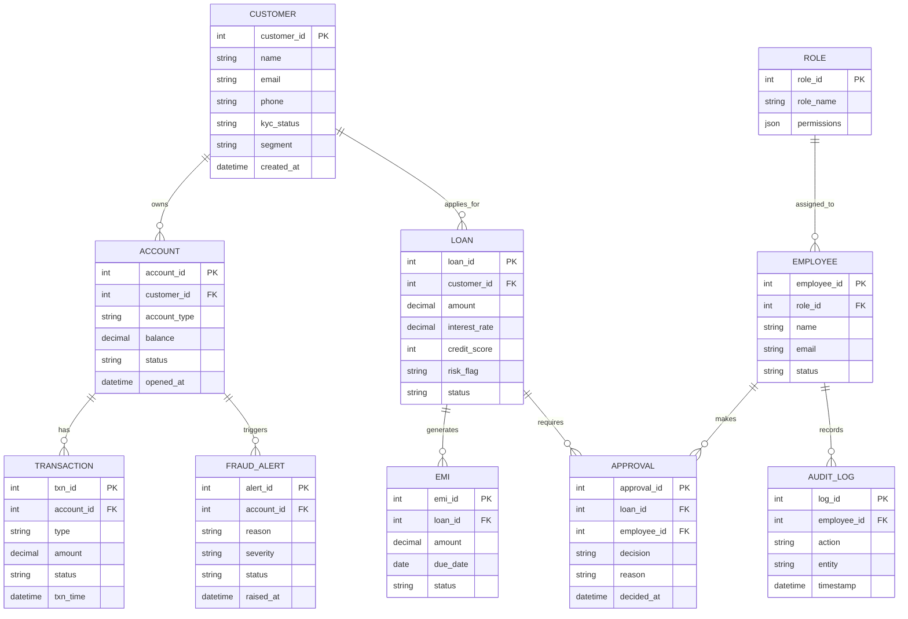

# Project Initiation Document (PID) — Smart Bank Manager

> A web application that lets a bank manager operate their branch fully
> digitally: manage all departments, approve decisions, monitor risk,
> and act on AI-driven insights from a single dashboard.
>
> This document is a build-ready specification. An AI agent (or a dev team)
> can use it to design and implement the full application end to end.

---

## 1. Project Overview

| Item | Detail |
|---|---|
| **Project Name** | Smart Bank Manager |
| **Type** | Web application (SaaS-style, role-based) |
| **Primary User** | Bank Branch Manager |
| **Secondary Users** | Tellers, Loan Officers, Compliance Officer, Admin |
| **Goal** | Replace scattered legacy banking tools with one smart dashboard |
| **Platform** | Responsive web (desktop-first, mobile-friendly) |

### Problem Statement
Bank managers today switch between many disconnected systems (accounts,
loans, fraud, HR, reports). This is slow, error-prone, and gives no single
view of branch health. Smart Bank Manager unifies every department into one
digital control center with AI assistance.

### Objectives
1. Give the manager a real-time, single-screen view of the whole branch.
2. Digitize all key workflows: accounts, loans, transactions, staff.
3. Reduce fraud and loan defaults using AI alerts.
4. Automate approvals and reporting to save time.
5. Keep a tamper-proof audit trail for compliance.

---

## 2. Scope

### In Scope (MVP)
- Manager dashboard with live branch metrics
- Customer & account management (open/close/freeze, KYC)
- Loan lifecycle (apply → review → approve → EMI tracking)
- Transaction monitoring & reconciliation
- Fraud/compliance alerts + audit log
- Staff (HR) management
- Report generation (PDF/Excel)
- Role-based access control (RBAC)

### Out of Scope (v1)
- Direct core-banking / RBI settlement integration (simulated instead)
- Mobile native apps (web is responsive)
- Multi-branch / multi-region rollout (single branch first)

---

## 3. User Roles & Permissions

| Role | Can Do |
|---|---|
| **Manager** | Full access, final approvals, all reports |
| **Loan Officer** | Create/review loans, cannot final-approve high value |
| **Teller** | Handle transactions, account requests |
| **Compliance Officer** | View fraud alerts, audit logs, file reports |
| **Admin** | Manage users, roles, system settings |

---

## 4. Modules (Departments)

1. **Dashboard** — KPIs, alerts, pending approvals, AI assistant.
2. **Customers & Accounts** — Profiles, digital KYC, account lifecycle.
3. **Loans & Credit** — Applications, AI credit score, EMI schedule.
4. **Transactions & Payments** — Monitor, transfer, reconcile, disputes.
5. **Fraud, Risk & Compliance** — Alerts, AML flags, audit trail.
6. **Staff (HR)** — Employees, leaves, tasks, performance.
7. **Reports & Analytics** — Auto reports, trends, exports.
8. **Settings & Admin** — Users, roles, product config.

### Unique Features (Differentiators)
- **AI Assistant** — Ask in plain language: "show overdue loans above 5L".
- **Fraud Freeze Button** — One click to lock a suspicious account.
- **Default Predictor** — Flags loans likely to default before they do.
- **Approval Automation** — Rules auto-route approvals by amount/type.
- **Branch Health Score** — Single number summarizing branch performance.

---

## 5. Tech Stack (Deep)

### Frontend
| Layer | Choice | Why |
|---|---|---|
| Framework | **React 18 + Vite** | Fast, component-based, huge ecosystem |
| Language | **TypeScript** | Type safety for financial data |
| Styling | **Tailwind CSS** | Rapid, consistent UI |
| UI Kit | **shadcn/ui** | Accessible prebuilt components |
| Charts | **Recharts / Chart.js** | Dashboards & analytics |
| State | **Redux Toolkit** or **Zustand** | Predictable app state |
| Data fetch | **React Query (TanStack)** | Caching, loading states |
| Forms | **React Hook Form + Zod** | Validation for KYC/loan forms |

### Backend
| Layer | Choice | Why |
|---|---|---|
| Runtime | **Node.js + Express** (or **NestJS**) | Scalable REST APIs |
| Alt option | **Spring Boot (Java)** | If enterprise/Java preferred |
| Auth | **JWT + Refresh tokens**, bcrypt | Secure sessions |
| RBAC | Middleware role checks | Per-role access |
| Validation | **Zod / class-validator** | Safe inputs |
| AI layer | **Claude / OpenAI API** | NL assistant, risk scoring |

### Database
| Type | Choice | Use |
|---|---|---|
| Primary DB | **PostgreSQL** | Accounts, loans, transactions (ACID) |
| Cache | **Redis** | Sessions, live dashboard data |
| Search/logs | **Elasticsearch** (optional) | Audit log search |

### DevOps / Infra
| Item | Choice |
|---|---|
| Hosting | AWS / Render / Vercel (frontend) |
| Containers | Docker + Docker Compose |
| CI/CD | GitHub Actions |
| Storage | AWS S3 (KYC docs) |
| Monitoring | Sentry + basic logging |

---

## 6. System Architecture

```
[ Browser (React SPA) ]
          |  HTTPS / REST
          v
[ API Gateway / Express ] --- [ Auth & RBAC Middleware ]
          |
   ----------------------------------------------------
   |            |            |            |            |
[Accounts]  [Loans]   [Transactions] [Fraud/AI]   [HR/Reports]
   |            |            |            |            |
   ----------------------------------------------------
          |                        |
     [ PostgreSQL ]           [ Redis Cache ]
          |
     [ S3: KYC Docs ]     [ AI API: assistant + scoring ]
```

- **Frontend** talks only to the API (never DB directly).
- **Auth middleware** checks JWT + role on every request.
- **AI service** is a separate module the backend calls for scoring/chat.
- **Audit logger** records every state-changing action.

---

## 7. Core Workflows

### 7.1 Loan Approval Workflow
```
Customer/Officer submits loan
        v
System runs AI credit score  --> generates risk flag
        v
If amount <= limit --> auto-route to Loan Officer
If amount >  limit --> route to Manager
        v
Reviewer checks docs + score
        v
   Approve? --YES--> Disburse --> EMI schedule created --> Audit log
        |
        NO --> Reject with reason --> Notify customer --> Audit log
```

### 7.2 Account Opening Workflow
```
New customer -> Fill KYC form -> Upload documents (S3)
        v
System validates + checks duplicates
        v
Teller reviews -> Manager approves
        v
Account created -> Welcome + credentials -> Audit log
```

### 7.3 Fraud Alert Workflow
```
Transaction occurs -> AI anomaly check (amount, location, pattern)
        v
Suspicious? --YES--> Alert Compliance + Manager dashboard
        v
Manager reviews -> [Fraud Freeze Button] locks account
        v
Compliance files report -> Audit log
```

### 7.4 Daily Manager Flow
```
Login -> Dashboard briefing (KPIs, alerts, approvals)
      -> Clear pending approvals
      -> Review fraud/risk alerts
      -> Ask AI assistant for insights
      -> Generate/export reports
```

---

## 8. ER Diagram (Entity Relationships)



---

## 9. Key API Endpoints (Sample)

| Method | Endpoint | Purpose |
|---|---|---|
| POST | `/auth/login` | Login, return JWT |
| GET | `/dashboard/summary` | KPIs + alerts |
| GET/POST | `/customers` | List / create customer |
| POST | `/accounts` | Open account |
| PATCH | `/accounts/:id/freeze` | Fraud freeze |
| POST | `/loans` | Apply for loan |
| POST | `/loans/:id/approve` | Approve/reject |
| GET | `/transactions` | List + filter |
| GET | `/fraud/alerts` | Fraud alerts |
| GET | `/reports/export` | PDF/Excel export |
| POST | `/ai/assistant` | Natural-language query |

---

## 10. Problems Faced & Solutions

| Problem | Solution |
|---|---|
| Handling sensitive financial data | Encryption at rest + TLS in transit, RBAC |
| Preventing fraud/false approvals | AI scoring + mandatory approval chain + audit log |
| Many roles, different access | Central RBAC middleware, permissions per role |
| Real-time dashboard performance | Redis caching + React Query |
| Accidental/irreversible actions | Confirmation + audit log + soft-delete (freeze) |
| KYC document storage | S3 with signed URLs, no public access |
| Scaling with more branches | Modular services, stateless APIs |
| AI giving wrong advice | AI is advisory only; human approves final action |

---

## 11. Non-Functional Requirements

- **Security:** JWT auth, RBAC, encryption, OWASP top-10 protection.
- **Performance:** Dashboard loads < 2s; APIs < 300ms average.
- **Reliability:** 99.5% uptime target; daily DB backups.
- **Auditability:** Every state change logged immutably.
- **Accessibility:** WCAG AA, keyboard nav, dark mode.
- **Scalability:** Stateless backend, horizontal scaling ready.

---

## 12. Future Scope

1. **Multi-branch & HQ view** — regional and national roll-ups.
2. **Mobile apps** — native iOS/Android for managers on the go.
3. **Voice assistant** — hands-free branch queries.
4. **Predictive analytics** — forecast deposits, defaults, growth.
5. **Blockchain audit trail** — tamper-proof compliance records.
6. **Customer self-service portal** — reduce teller load.
7. **Open Banking / API integrations** — connect to real core banking.
8. **Gamified staff performance** — leaderboards and targets.

---

## 13. Uniqueness (Why This Stands Out)

- **One control center** instead of many disconnected tools.
- **AI-first**: plain-language assistant + predictive risk built in.
- **Fraud Freeze Button**: instant, one-click protection.
- **Default Predictor**: catches risky loans before they fail.
- **Branch Health Score**: complex data as one clear number.
- **Approval Automation**: cuts manual routing and delays.

---

## 14. Suggested Build Phases

| Phase | Deliverable |
|---|---|
| **Phase 1 (MVP)** | Auth + RBAC, Dashboard, Customers, Accounts |
| **Phase 2** | Loans + approvals, Transactions |
| **Phase 3** | Fraud/compliance, Audit log |
| **Phase 4** | HR, Reports, AI Assistant |
| **Phase 5** | Polish, security hardening, deploy |

---

*End of PID — ready to hand to an AI agent or dev team to build Smart Bank Manager.*
