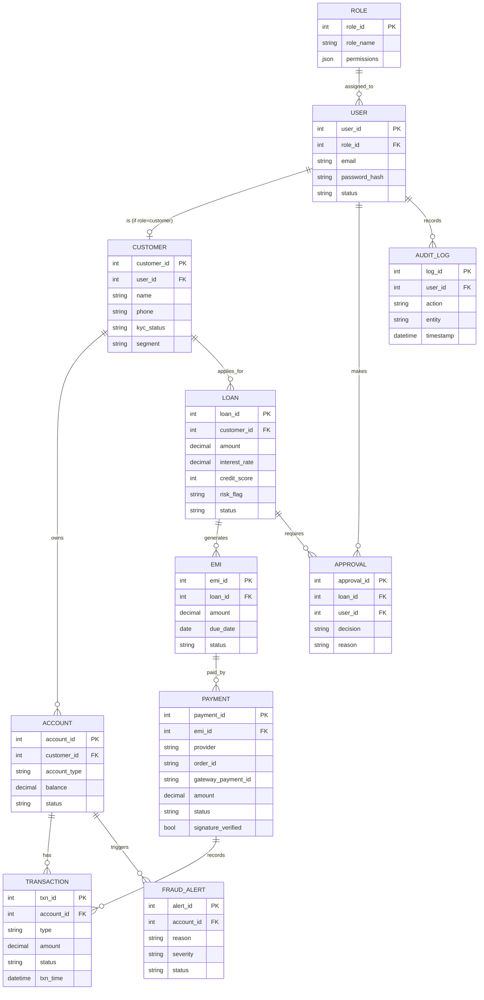

# Project Initiation Document (PID) — Smart Bank Manager (v2)

> A role-based web platform where **bank staff run their branch digitally** and
> **customers self-serve** — accounts, loans, EMIs, payments, and AI-driven
> insights — from one cohesive, secure application.
>
> This is a build-ready specification. An AI agent (or a dev team) can use it to
> design and implement the full application end to end.
>
> **v2 adds:** Customer self-service portal, bank-authority views, Admin
> dashboard, Analytics dashboard, platform-wide pagination / filtering /
> sorting / Elasticsearch, Razorpay/Stripe payment gateway, and a unified
> design system to remove the "AI-generated" look.

---

## 1. Project Overview

| Item | Detail |
|---|---|
| **Project Name** | Smart Bank Manager |
| **Type** | Web application (SaaS-style, multi-role) |
| **Primary Users** | Bank Branch Manager, **Customers** |
| **Secondary Users** | Tellers, Loan Officers, Compliance Officer, Admin, **Bank/Regional Authority** |
| **Goal** | One smart platform for staff operations **and** customer self-service |
| **Platform** | Responsive web (desktop-first, mobile-friendly) |

### Problem Statement
Banks juggle disconnected systems for staff, while customers depend on branch
visits and phone calls. Smart Bank Manager unifies every department into one
digital control center **and** gives customers a secure self-service portal —
with AI assistance, real payments, and fast search across all data.

### Objectives
1. Serve **many user types** (staff + customers) from one platform with strict RBAC.
2. Give staff a real-time single-screen view; give customers self-service.
3. Provide **Admin** and **Analytics** dashboards for control and insight.
4. Make every data list fast and usable via pagination, filtering, sorting, and search.
5. Let customers **pay online** (EMIs/bills) through a secure payment gateway.
6. Reduce fraud and defaults with AI alerts; keep a tamper-proof audit trail.
7. Deliver a polished, consistent, branded UI (no mismatched pages).

---

## 2. Scope

### In Scope (v2)
- **Staff side:** Manager dashboard, Customers & Accounts, Loans, Transactions,
  Fraud/Compliance, HR, Reports.
- **Customer portal:** accounts & balances, transaction history, loan apply +
  EMI tracking, **online EMI/bill payment**, KYC updates, statements, disputes.
- **Admin dashboard:** users, roles, granular permissions, product config,
  system settings, audit-log search, feature flags, health.
- **Analytics dashboard:** KPIs, trends, drill-downs, exports.
- **Data techniques everywhere:** pagination, filtering, sorting, Elasticsearch search.
- **Payments:** Razorpay/Stripe integration (provider-configurable).
- **Unified design system** + single, branded login experience.
- Role-based access control (RBAC), audit log, AI assistant & risk scoring.

### Out of Scope (v1/v2)
- Direct core-banking / RBI settlement integration (simulated).
- Native mobile apps (web is responsive).
- Multi-branch settlement/clearing (authority views are read/analytics only).

---

## 3. User Roles & Permissions

| Role | Can Do |
|---|---|
| **Customer** | View own accounts, transactions, loans, EMIs; apply for loans; **pay EMIs/bills online**; update KYC; download statements; raise disputes |
| **Manager** | Full branch access, final approvals, all reports |
| **Loan Officer** | Create/review loans; cannot final-approve high value |
| **Teller** | Handle transactions, account requests |
| **Compliance Officer** | Fraud alerts, audit logs, file reports |
| **Bank/Regional Authority** | Read-only cross-branch analytics & compliance roll-ups |
| **Admin** | Manage users, roles, granular permissions, product config, system settings |

- **Strict data scoping:** customers see only their own data; staff see data
  scoped to role; authority sees aggregates only.
- Enforced via **JWT + role/permission middleware** on every request.

---

## 4. Modules

### Staff
1. **Dashboard** — KPIs, alerts, pending approvals, AI assistant.
2. **Customers & Accounts** — profiles, digital KYC, account lifecycle.
3. **Loans & Credit** — applications, AI credit score, EMI schedule.
4. **Transactions & Payments** — monitor, transfer, reconcile, disputes.
5. **Fraud, Risk & Compliance** — alerts, AML flags, audit trail.
6. **Staff (HR)** — employees, leaves, tasks, performance.
7. **Reports & Analytics** — auto reports, trends, exports.

### Customer
8. **Customer Portal** — accounts overview, transactions, loan apply & EMIs,
   **online payments**, KYC, statements, disputes, notifications.

### Platform
9. **Admin Dashboard** — users, roles, permissions, product config, settings,
   feature flags, session/health monitoring, audit-log search.
10. **Analytics Dashboard** — KPIs, trends, drill-downs, exports (staff/authority).

### Unique Features (Differentiators)
- **AI Assistant** — plain-language queries ("show overdue loans above 5L").
- **Fraud Freeze Button** — one click to lock a suspicious account.
- **Default Predictor** — flags loans likely to default before they do.
- **Approval Automation** — rules auto-route approvals by amount/type.
- **Branch Health Score** — single number summarizing branch performance.
- **Self-service payments** — customers clear EMIs/bills without a teller.

---

## 5. Tech Stack

### Frontend
| Layer | Choice | Why |
|---|---|---|
| Framework | **React 18 + Vite** | Fast, component-based |
| Language | **TypeScript** | Type safety for financial data |
| Styling | **Tailwind CSS** | Rapid, consistent UI |
| UI Kit | **shadcn/ui** | Accessible prebuilt components |
| Charts | **Recharts** | Dashboards & analytics |
| State | **Redux Toolkit** or **Zustand** | Predictable state |
| Data fetch | **React Query (TanStack)** | Caching, server-driven tables |
| Forms | **React Hook Form + Zod** | KYC/loan/payment validation |
| Payments | **Razorpay Checkout / Stripe.js** | Client-side payment capture |

### Backend
| Layer | Choice | Why |
|---|---|---|
| Runtime | **Node.js + Express** (or NestJS) | Scalable REST APIs |
| Auth | **JWT + Refresh tokens**, bcrypt | Secure sessions |
| RBAC | Middleware role/permission checks | Per-role & per-record scoping |
| Validation | **Zod / class-validator** | Safe inputs |
| Payments | **Razorpay / Stripe SDK + webhooks** | Orders, verification, idempotency |
| AI layer | **Claude / OpenAI API** | NL assistant, risk scoring |

### Database & Search
| Type | Choice | Use |
|---|---|---|
| Primary DB | **PostgreSQL** | Source of truth (ACID) |
| Cache | **Redis** | Sessions, live dashboards, idempotency keys |
| Search | **Elasticsearch** | Full-text search over customers, transactions, audit logs |

### DevOps / Infra
| Item | Choice |
|---|---|
| Hosting | AWS / Render / Vercel (frontend) |
| Containers | Docker + Docker Compose |
| CI/CD | GitHub Actions |
| Storage | AWS S3 (KYC docs, statements) |
| Monitoring | Sentry + structured logging |
| Secrets | Env vars / secrets manager (**payment keys never hardcoded**) |

---

## 6. System Architecture

```
[ React SPA — Staff app + Customer portal ]
          |  HTTPS / REST
          v
[ API Gateway / Express ] --- [ Auth + RBAC + Scoping Middleware ]
          |
  --------------------------------------------------------------
  |         |          |          |          |          |        |
[Accounts][Loans][Transactions][Fraud/AI][HR/Reports][Payments][Admin]
  |         |          |          |          |          |        |
  --------------------------------------------------------------
          |                 |                 |              |
     [ PostgreSQL ]    [ Redis Cache ]   [ Elasticsearch ]  [ Payment
          |                                    ^              Gateway ]
     [ S3: docs ]        [ AI API ]      (CDC/sync from PG)  (webhooks)
```

- Frontend never touches DB directly.
- Auth middleware checks JWT + role + **record ownership** on every request.
- **Elasticsearch** is kept in sync from Postgres (write-through or CDC).
- **Payment service** creates orders, verifies signatures, handles webhooks
  idempotently, then records transactions and updates EMI status.
- Audit logger records every state-changing action.

---

## 7. Cross-Cutting Data Techniques (apply to ALL list endpoints)

Applies to: customers, accounts, transactions, loans, EMIs, fraud alerts,
audit logs, users.

### 7.1 Pagination
- Offset (`page`, `pageSize`) or cursor-based for large sets.
- Response meta: `{ total, page, pageSize, totalPages, nextCursor }`.

### 7.2 Filtering
- Per-field filters: `status`, `type`, `dateFrom/dateTo`, `amountMin/amountMax`,
  `accountId`, `customerId`, etc. Combinable (AND).

### 7.3 Sorting
- Multi-field, e.g. `sort=amount:desc,createdAt:asc` on allowed columns only.

### 7.4 Elasticsearch Search
- Index customers, transactions, audit logs.
- Full-text with relevance ranking, highlighting, typo tolerance (fuzziness).
- Postgres remains source of truth; ES updated on write / via sync job.
- Endpoint: `GET /search?index=transactions&q=...&filters=...&page=...`.

### Standard list request contract
```
GET /transactions?page=1&pageSize=20&sort=txnTime:desc
    &status=completed&amountMin=1000&dateFrom=2026-01-01&q=refund
```
Frontend: one reusable server-driven table component (React Query) that wires
pagination, sort, filter, and search for every module.

---

## 8. Payment Gateway Integration

> Provider-configurable (**Razorpay and/or Stripe**). API keys supplied via
> environment variables; **secret keys never reach the client**.

### Flow
```
Customer clicks "Pay EMI"
        v
Backend creates order/intent (amount, currency, receipt) --> returns order id
        v
Frontend opens Razorpay Checkout / Stripe.js with public key + order id
        v
Customer pays --> gateway returns payment id + signature
        v
Backend verifies signature (+ webhook confirmation, idempotent)
        v
Record Transaction --> mark EMI paid --> notify customer --> Audit log
```

- Handle **success, failure, pending**; retry-safe via **idempotency keys** (Redis).
- **Webhooks** are the source of truth for final status.
- Store gateway `payment_id`, `order_id`, `status`, `signature_verified`.
- Env vars: `PAYMENT_PROVIDER`, `RAZORPAY_KEY_ID/SECRET`, `STRIPE_PUBLISHABLE/SECRET`, `WEBHOOK_SECRET`.

---

## 9. Dashboards

### 9.1 Admin Dashboard
- User CRUD, role assignment, **granular permission editor**.
- Product config (loan products, rates, fees), system settings, feature flags.
- **Audit-log search** (Elasticsearch), active sessions, system health.

### 9.2 Analytics Dashboard
- KPIs: deposits, loans disbursed, default rate, txn volume, fraud alerts,
  revenue, customer growth, branch health score.
- Interactive Recharts with date-range filters, drill-downs, comparisons.
- Export CSV/PDF. Authority role sees cross-branch roll-ups (read-only).

---

## 10. Design System (remove the "AI-generated" look)

- **One** font family + type scale; consistent spacing and radius tokens.
- Defined color palette with **light + dark** modes (design tokens).
- Consistent button / card / table / form / modal / toast styles (shadcn/ui).
- **Single unified, branded login/auth** experience for all roles — no varied
  or mismatched login pages.
- Proper empty states, loading skeletons, toasts, and error states.
- Accessibility: WCAG AA, keyboard nav, focus states.

---

## 11. Key API Endpoints (Sample)

| Method | Endpoint | Purpose |
|---|---|---|
| POST | `/auth/login` | Login, return JWT (all roles) |
| POST | `/auth/customer/register` | Customer onboarding |
| GET | `/dashboard/summary` | Staff KPIs + alerts |
| GET | `/analytics/*` | Analytics metrics & trends |
| GET | `/me/accounts` | Customer's own accounts |
| GET | `/me/transactions` | Customer txns (paginate/filter/sort) |
| GET/POST | `/customers` | Staff: list/create (paginate/filter/sort) |
| POST | `/accounts` | Open account |
| PATCH | `/accounts/:id/freeze` | Fraud freeze |
| POST | `/loans` | Apply for loan |
| POST | `/loans/:id/approve` | Approve/reject |
| POST | `/payments/order` | Create payment order/intent |
| POST | `/payments/verify` | Verify payment signature |
| POST | `/payments/webhook` | Gateway webhook (idempotent) |
| GET | `/search` | Elasticsearch full-text search |
| GET | `/admin/users` | Admin: user management |
| GET | `/admin/audit-logs` | Audit-log search |
| GET | `/reports/export` | PDF/Excel export |
| POST | `/ai/assistant` | Natural-language query |

---

## 12. ER Diagram (updated)



---

## 13. Non-Functional Requirements

- **Security:** JWT + refresh, RBAC + record scoping, encryption at rest/TLS,
  OWASP Top-10, PCI-aware payment handling (no card data stored; keys in secrets).
- **Performance:** dashboards < 2s; list APIs < 300ms avg; ES search < 200ms.
- **Reliability:** 99.5% uptime; daily backups; idempotent payments/webhooks.
- **Auditability:** every state change logged immutably and searchable.
- **Accessibility:** WCAG AA, keyboard nav, dark mode.
- **Scalability:** stateless backend, horizontal scaling, ES for search load.

---

## 14. Suggested Build Phases

| Phase | Deliverable |
|---|---|
| **1** | Auth + RBAC (all roles), unified login, design system, Staff dashboard |
| **2** | Customers & Accounts, Loans + approvals, Transactions |
| **3** | Pagination/filtering/sorting on all lists + Elasticsearch search |
| **4** | Customer portal + **payment gateway** (Razorpay/Stripe) |
| **5** | Admin dashboard + Analytics dashboard |
| **6** | Fraud/compliance, audit log, AI assistant |
| **7** | Polish, security hardening, deploy |

---

## 15. Configuration & Setup Notes

- Provide `.env` with: DB/Redis/ES connection, JWT secrets, S3, AI API key,
  `PAYMENT_PROVIDER`, gateway keys, and `WEBHOOK_SECRET`.
- Seed data + README covering: how to run, env vars, and ES indexing/sync.
- User will supply payment API keys — agent must request them at Phase 4 and
  never hardcode or expose secret keys client-side.

---

*End of PID v2 — ready to hand to an AI agent or dev team to build the enhanced
Smart Bank Manager.*
